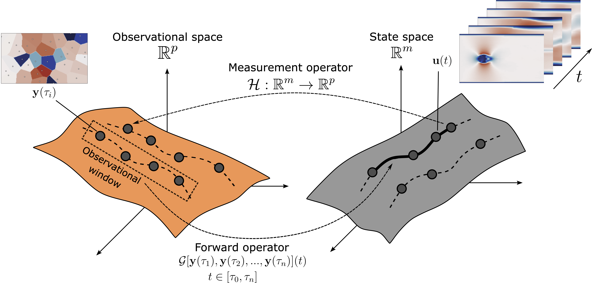
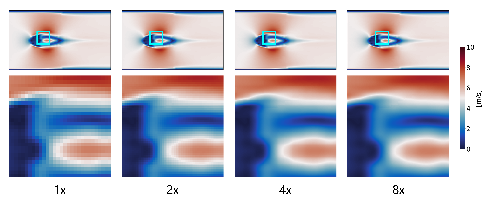

# FLRONet: Deep Operator Learning for Flow Field Reconstruction from Sparse Sensors

Official implementation of **FLRONet**, a spatiotemporal deep operator network for reconstructing high‑fidelity fluid flow fields from sparse sensor measurements.

**Paper**

> **Hiep Vo Dang, Phong C. H. Nguyen**  
> *Deep Operator Learning for High‑Fidelity Fluid Flow Field Reconstruction From Sparse Sensor Measurements*  
> *Journal of Computing and Information Science in Engineering*, 2026  
> DOI: [10.1115/1.4070332](https://doi.org/10.1115/1.4070332)

<p align="center">
  
</p>

---

## Table of contents

- [Overview](#overview)
- [Key ideas](#key-ideas)
- [Method at a glance](#method-at-a-glance)
- [Zero-shot super-resolution](#zero-shot-super-resolution)
- [Robustness to sensor failures](#robustness-to-sensor-failures)
- [Quickstart](#quickstart)
- [Repository structure](#repository-structure)
- [Environment setup](#environment-setup)
- [Data: CFDBench](#data-cfdbench)
- [Training](#training)
- [Evaluation](#evaluation)
- [Inference](#inference)
- [Outputs](#outputs)
- [Citation](#citation)

---

## Overview

FLRONet reconstructs a high‑dimensional spatiotemporal flow field from sparse sensor measurements by learning an **inverse operator** in function space.

- Sparse sensor measurements $y(\tau_i)$ are collected at discrete times within an observation window, forming a low‑dimensional **observation space** $\mathbb{R}^p$.
- These measurements relate to the high‑dimensional flow field $u(t) \in \mathbb{R}^m$ via an ill‑conditioned operator $\mathcal{H}: \mathbb{R}^m \to \mathbb{R}^p$.
- FLRONet learns an approximation of $\mathcal{H}^{-1}$, mapping a sequence of sensor observations $\{y(\tau_1), \dots, y(\tau_n)\}$ directly to the flow field.
- The reconstruction is **continuous in time and space**, enabling discretization‑independent prediction and zero‑shot spatiotemporal interpolation inside the observation window.

<p align="center">
  
</p>

---

## Key ideas

- Operator‑learning formulation for sparse‑sensor flow reconstruction
- Discretization independence in **both space and time**
- Zero‑shot spatial super‑resolution (no retraining)
- Continuous temporal interpolation at arbitrary query times
- Robustness to missing and noisy sensors
- Faster and better inference than 3D FNO baselines (see paper for benchmarks)

---

## Method at a glance

FLRONet decomposes the inverse reconstruction operator into:

- A **spatial branch network** (e.g., FNO‑based) that maps sparse sensor snapshots to a latent field representation
- A **temporal trunk network** that maps continuous query times to reconstruction weights
- A dot‑product fusion that yields the reconstructed flow field as a continuous function of space and time

<p align="center">
  
</p>

---

## Zero-shot super-resolution

### Spatial super-resolution

Trained at $(140\times240)$, FLRONet performs inference at $(280\times480)$, $(560\times960)$, and $(1120\times1920)$ ($2\times$, $4\times$, and $8\times$ upscaling). In practice, the maximum upscale factor is limited by available GPU VRAM.

<p align="center">
  
</p>

### Continuous super-resolution in time

Even when trained on discrete time intervals (e.g., $\Delta t = 10^{-3}\,s$), FLRONet can reconstruct at any continuous query time $t$ within the observation window, up to floating‑point precision.

<p align="center">
  
</p>

---

## Robustness to sensor failures

### Missing sensors

- FLRONet maintains stable reconstruction accuracy even under extreme random sensor dropout.
- Treating sensor observations as a **function** rather than a fixed‑length vector reduces sensitivity to incomplete data.

<p align="center">
  
</p>

*Caption:* FLRONet remains reliable under extreme Voronoi‑input instability caused by random sensor dropout.

### Noisy sensors

- FLRONet remains accurate under substantial measurement noise (e.g., up to ~20% relative to sensor magnitude in the paper).
- Spectral filtering in Fourier layers suppresses high‑frequency noise by truncating noisy Fourier modes.

<p align="center">
  
</p>

*Caption:* FLRONet remains robust under Voronoi‑input instability caused by random sensor noise.

---

## Quickstart

```bash
# 1) Clone this repository
git clone --depth 1 git@github.com:hiepdang-ml/FLRONet.git
cd FLRONet

# 2) Create and activate environment
conda env create -f env.yaml
conda activate FLRONet

# 3) Set environment variables
export PYTHONPATH=.
export PATH="$(pwd):$PATH"

# 4) Download CFDBench data
bash getcfdbench.sh

# 5) Train
python train.py --config=config.yaml

# 6) Evaluate
python evaluate.py --config=config.yaml

# 7) Inference (arbitrary times/resolutions)
python inference.py --config=config.yaml
```

---

## Repository structure

- `common/` — helper classes and utilities
- `cfd/` — dataset + preprocessing modules
- `model/` — FLRONet variants and baselines (e.g., FNO)
- `worker/` — trainer / evaluator / predictor code
- `config.yaml` — central configuration
- `env.yaml` — conda environment specification
- `getcfdbench.sh` — download script for CFDBench raw files

---

## Environment setup

### 1) Clone this repository:

```bash
git clone --depth 1 git@github.com:hiepdang-ml/FLRONet.git
cd FLRONet
```

### 2) Create and activate the conda environment

```bash
conda env create -f env.yaml
conda activate FLRONet
```

### 3) Set environment variables

```bash
export PYTHONPATH=.
export PATH="$(pwd):$PATH"
```

### 4) Sanity check

```bash
python -c "import torch; print('torch:', torch.__version__); print('cuda:', torch.cuda.is_available())"
```

---

## Data: CFDBench

Download CFDBench raw data files (you may be prompted for `sudo` password to install `zip` / `unzip`):

```bash
bash getcfdbench.sh
```

---

## Training

### Choose model variant

Edit `config.yaml`:

```yaml
architecture:
  model_name: "flronet-fno"   # options: "flronet-fno", "flronet-unet", "flronet-mlp", "fno3d"
```

### Choose sensor embedding type

```yaml
dataset:
  embedding_generator: "Voronoi"  # options: "Voronoi", "Mask", "Vector"
```

Notes:
- For `flronet-fno`, `flronet-unet`, or `fno3d`, set `embedding_generator` to `Voronoi` (recommended) or `Mask`.
- For `flronet-mlp`, set `embedding_generator` to `Vector`.

### Train from scratch vs. resume

```yaml
training:
  from_checkpoint: null  # set to a path to resume training
```

Example:

```yaml
training:
  from_checkpoint: "/path/to/checkpoint.pt"
```

### Run training

```bash
python train.py --config=config.yaml
```

---

## Evaluation

1) Point to a trained checkpoint:

```yaml
evaluate:
  from_checkpoint: "/path/to/checkpoint.pt"
```

2) (Optional) configure sensor dropout and noise:

```yaml
evaluate:
  n_dropout_sensors: 5   # <= dataset.n_sensors
  noise_level: 0.05      # 5% (epsilon in the paper)
```

3) Run:

```bash
python evaluate.py --config=config.yaml
```

> Make sure `architecture.model_name` and `dataset.embedding_generator` match the checkpoint you’re evaluating.

---

## Inference

Inference is for running the model on cases that may not be in the test set. It also enables inference at **new temporal and spatial resolutions**, so there may be no ground truth to compare against.

1) Select a checkpoint:

```yaml
inference:
  from_checkpoint: "/path/to/checkpoint.pt"
```

2) Choose query times (continuous) and output resolution:

```yaml
inference:
  sensor_timeframes: [40, 45, 50, 55, 60]   # example observation window times
  reconstruction_timeframes: [52.12342345]  # arbitrary query time within the window
  out_resolution: [1120, 1920]              # 8x upscale from 140x240
```

3) Run:

```bash
python inference.py --config=config.yaml
```

---

## Outputs

- Evaluation and inference results are saved under a newly created `plots/` directory.

---

## Citation

If you find this work interesting, please cite the FLRONet paper:

```bibtex
@article{dang2025deeoperator,
  author  = {Dang, Hiep Vo and Nguyen, Phong C. H.},
  title   = {Deep Operator Learning for High-Fidelity Fluid Flow Field Reconstruction From Sparse Sensor Measurements},
  journal = {Journal of Computing and Information Science in Engineering},
  year    = {2025},
  volume  = {26},
  number  = {1},
  pages   = {011007},
  doi     = {10.1115/1.4070332}
}
```

---

